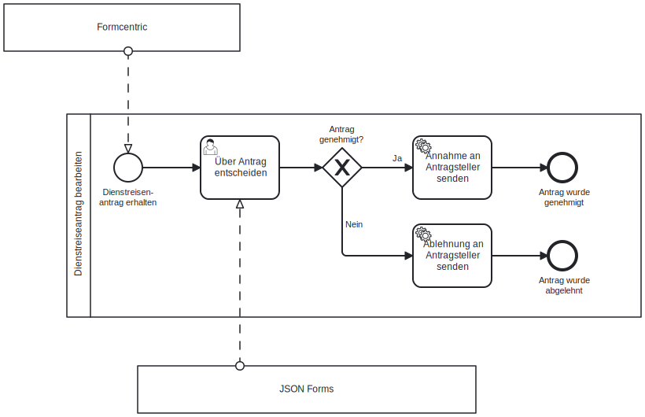
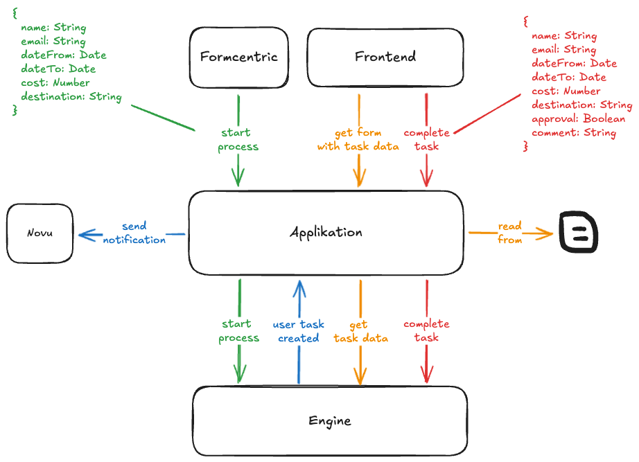
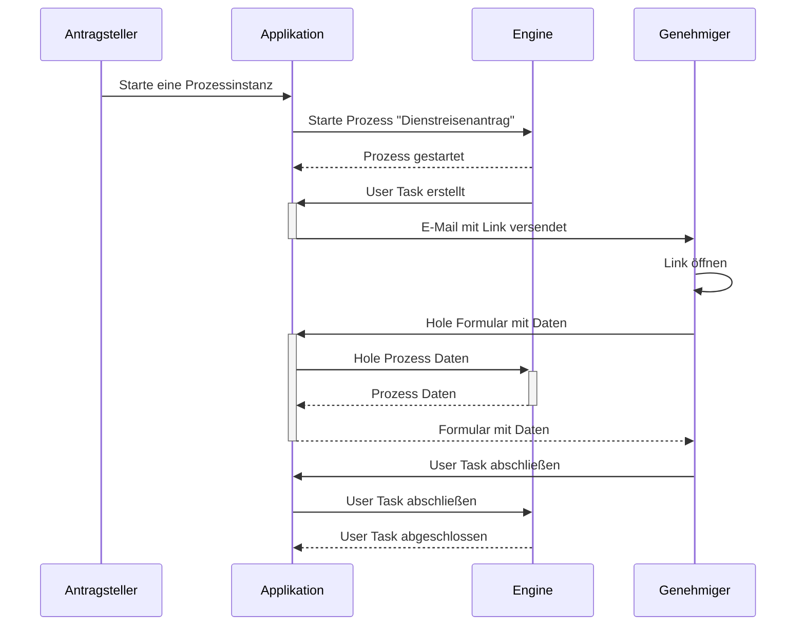

# Business Trip Showcase

## Getting started

1. Start the backend
   ```shell
   cd process-application
   export $(grep -v '^#' src/main/resources/.env | xargs) && mvn spring-boot:run
   ```

2. Start the frontend
   ```shell
   cd frontend
   yarn
   yarn serve
   ```

## Prozess



## Architektur



## Ablauf



## Technologien

* Camunda 7 / 8
* [Process Engine API](https://github.com/bpm-crafters/process-engine-api)
* [Formcentric](https://formcentric.com/de/)
* [Novu](https://docs.novu.co/platform/overview)
* [JSON Forms](https://jsonforms.io/docs/)
