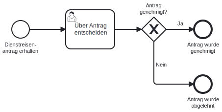
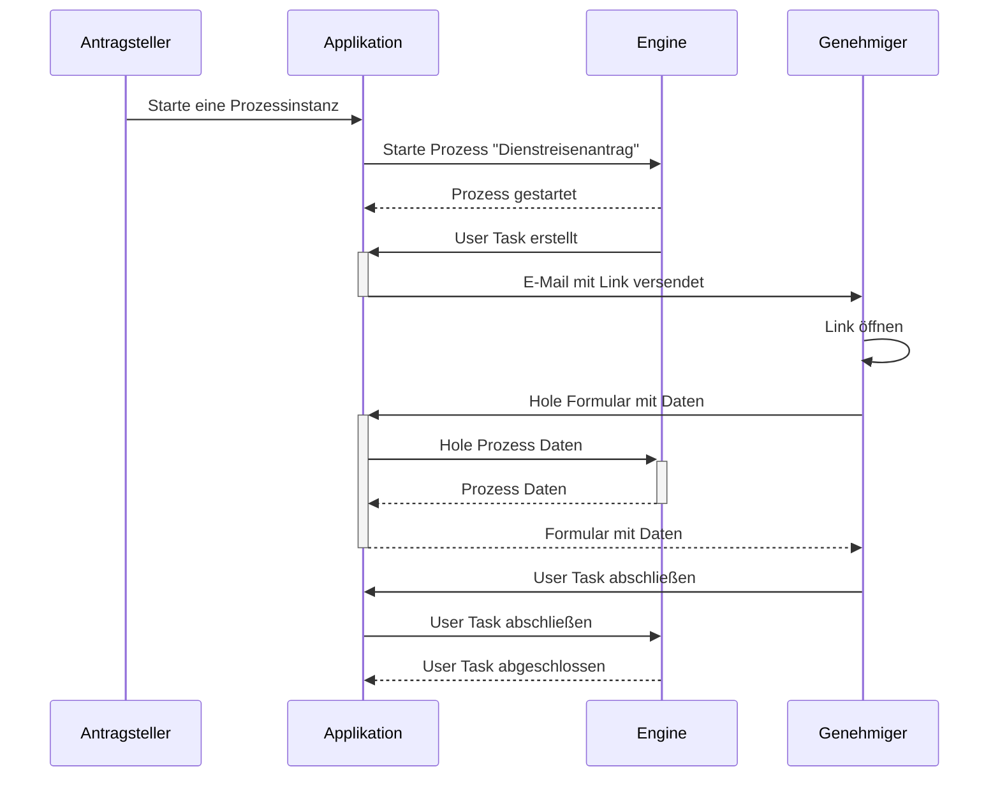

# Formcentric Showcase

## Prozess

## Ablauf

```mermaid
sequenceDiagram
    Antragsteller ->> Applikation: Starte eine Prozessinstanz
    Applikation ->> Engine: Starte Prozess "Dienstreisenantrag"
    Engine -->> Applikation: Prozess gestartet
    Engine ->>+ Applikation: User Task erstellt
    Applikation ->>- Genehmiger: E-Mail mit Link versendet
    Genehmiger ->> Genehmiger: Link öffnen
    Genehmiger ->>+ Applikation: Hole Formular mit Daten
    Applikation ->>+ Engine: Hole Prozess Daten
    Engine -->>- Applikation: Prozess Daten
    Applikation -->>- Genehmiger: Formular mit Daten
    Genehmiger ->> Applikation: User Task abschließen
    Applikation ->> Engine: User Task abschließen
    Engine -->> Applikation: User Task abgeschlossen
```

## Technologien

* Camunda 7 / 8
* Process Engine API
* JSON Forms